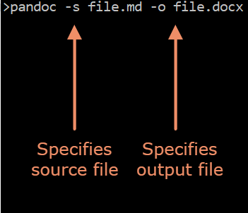

# Converting Markdown Files to Word Using Pandoc

Converting documents using Pandoc is a simple process, but it requires
paying close attention to a few key details. The instructions below
provide a guide for converting Markdown files to Word files via Pandoc.

## Steps

1.  Pandoc accepts commands through the computer's "Terminal" program.
    In Windows, this program is called "Command Prompt," while in Mac,
    it is simply called "Terminal."

2.  Before converting any file via Pandoc, you must specify the folder
    in which the file is located. This is achieved by typing "cd" in the
    Terminal, followed by the location of the folder. The location can
    be pasted by dragging the folder itself into the command line. Press
    Enter to specify the folder location.

3.  First, type "pandoc" into the command line, following by "-s" and
    the name of the Markdown file (e.g. "file.md").

4.  Next, type "-o" followed by the intended Word file name (e.g.
    "file.docx").

5.  Press Enter.

<figure>

<figcaption><b>Sample code for converting from Markdown to Word via Pandoc</b></figcaption>
</figure>

